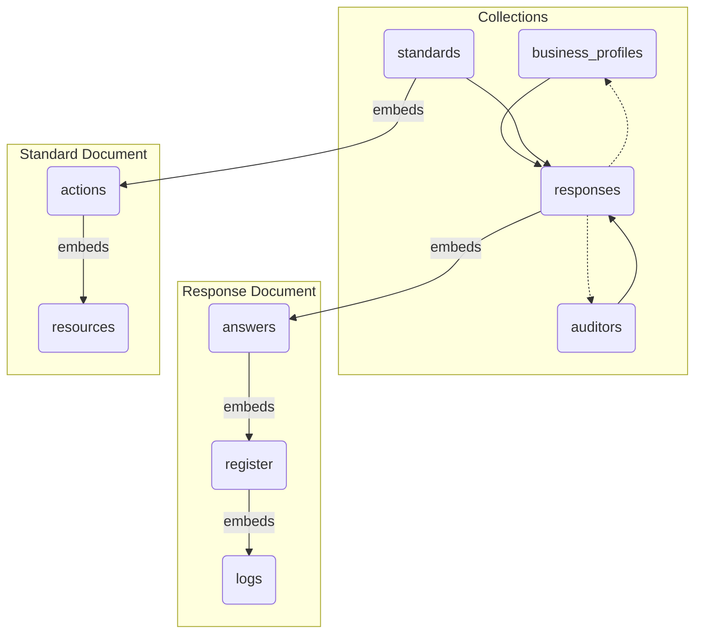

# Project: Standardization of Agricultural and Agro-industrial Standards Data for Firestore

This project involves the standardization of agricultural and agro-industrial standards data, designed to be stored in **Firestore**. The following conceptual data model describes the collections, documents, and their relationships, aiming for consistency and clarity in a NoSQL context.

### High-Level Overview: A NoSQL Approach for Flexibility

This data model is designed for Firestore, a NoSQL document database. Instead of rigid tables with rows and columns, we use **collections** that hold individual **documents**. Think of a collection like a folder, and a document like a file with its own unique structure.

This approach offers two key advantages:

1.  **Flexibility**: Each document can have a slightly different structure. This is perfect for our case, where different standards may require different kinds of data.
2.  **Performance**: By embedding related data within a single document (e.g., embedding answers within a response), we can often retrieve all the information we need in a single read operation, which is much faster and more cost-effective in Firestore.

We use two main techniques to relate data:

*   **Embedding**: Placing an object or an array of objects directly inside a document. We do this when the data is tightly coupled and usually accessed together (e.g., the answers within a single response).
*   **Referencing**: Storing the ID of a document from another collection. We do this when data is shared or accessed independently (e.g., referencing an `auditor` from multiple `responses`).

---

### Detailed Breakdown of Collections and Documents

#### 1. `business_profiles` (Collection)

*   **Purpose**: This is the master list of all businesses in the system. It acts as the single source of truth for business information.
*   **Document ID**: The business's unique tax identifier (`rut`). Using a natural identifier like the RUT as the document ID makes it very easy and efficient to look up a specific business.
*   **Fields**: Contains static information about the business, such as its name, address, size, and contact details for the owner.

#### 2. `standards` (Collection)

*   **Purpose**: This collection holds the master templates for all the different standards (e.g., "Agricultural Agreement for Plums", "Primary Production for Plums").
*   **Document ID**: A descriptive name for the template (e.g., `ciruelas-aa`).
*   **Fields**:
    *   `description`: A human-readable description of the standard.
    *   `questions`: This is an **array of embedded `action` objects**. It contains every question, requirement, and piece of information that defines that specific standard. By embedding the questions, we ensure that a single read of a `standard` document gives us the entire template.

#### 3. `auditors` (Collection)

*   **Purpose**: A central registry for all auditors who can verify responses.
*   **Document ID**: The auditor's unique ID (`auditor_id`).
*   **Fields**: Contains the auditor's name and contact information, as well as a list of business RUTs they are assigned to, which allows for easily querying all businesses for a specific auditor.

#### 4. `responses` (Collection)

*   **Purpose**: This is the most dynamic collection. It stores the answers provided by a business for a specific standard. Each document represents a single business's attempt to complete a standard.
*   **Document ID**: An auto-generated unique ID from Firestore. We don't use a natural ID here because a business might have multiple responses over time.
*   **Fields**:
    *   `business_rut`: A **reference** to the `business_profiles` collection. This links the response back to the business that provided it.
    *   `auditor_id`: A **reference** to the `auditors` collection. This assigns an auditor to review this specific response.
    *   `is_completed` and `date`: Metadata for tracking the status and timestamp of the response.
    *   `answers`: This is the core of the response document. It's an **array of embedded `answer` objects**, where each object represents the business's answer to a single question from the standard.

---

### Deep Dive: `answer`, `register`, and `logs`

This is where the model's flexibility really shines. The goal is to handle different kinds of verification for different questions within the same structure. A question might require a simple "Yes/No" answer, a photograph, a PDF document, or a detailed log of activities.

#### The `answer` Object (Embedded in `response`)

The `answer` object is the bridge between a question and its response.

*   `action`: It **embeds a full copy of the `action` (question) object** from the `standard` template. This is a crucial design choice. It "freezes" the question as it was when the user answered it. If the master `standard` template is updated later, it won't affect the historical record of this response, which is essential for auditing and compliance.
*   `answer_value`: This holds the direct answer from the user (e.g., "Yes", "No", a number, or a text selection).
*   `register`: This field only exists if the question requires verification (i.e., the `verification_type` in the `action` object is set to `image`, `document`, or `log`). It **embeds a `register` object**.

#### The `register` Object (Embedded in `answer`)

The `register` object is a container for the evidence provided by the user. Its structure is polymorphic, meaning it changes based on the type of verification required.

*   **Common Fields**:
    *   `upload_timestamp`, `validation_status`, `auditor_comments`: These are metadata fields used by the auditor to track the verification process for this specific piece of evidence.

*   **Conditional Fields**: This is the key to its flexibility.
    *   If `verification_type` was `image`, the `register` object will contain an `image_url` field pointing to the uploaded photo in a storage service (like Google Cloud Storage).
    *   If `verification_type` was `document`, it will contain a `document_url` field pointing to the uploaded PDF, Word document, etc.
    *   If `verification_type` was `log`, it will contain a `logs` field.

#### The `logs` Object (Embedded in `register`)

The `logs` field is not a single object, but an **array of `log` entry objects**. This is designed for structured, repeatable data that would be cumbersome to upload as a single document, like a maintenance log or a record of fertilizer application.

*   **Purpose**: It allows users to enter structured data directly into the application, which is then stored as an array of objects. This is far more powerful than uploading a spreadsheet because the data is now queryable.
*   **Structure**: Each `log` entry in the array has two fields:
    *   `standard_code`: This indicates which question the log entry is for.
    *   `data`: This is a JSON object whose schema is **strictly defined by the `standard_code`**.

*   **Example**: Let's look at `standard_code: "A001"` (Water Consumption).
    A `log` entry for this standard will have a `data` object with the following fields:
    *   `supply_source`: "Canal"
    *   `monthly_consumption_m3`: 150
    *   `process_use_type`: "Irrigation"

    For `standard_code: "A033"` (Fertilizer Application), a `log` entry would look completely different:
    *   `product_name`: "Super Grow"
    *   `lot_number`: 12345
    *   `application_date`: "2025-08-28T10:00:00Z"
    *   `dose_applied`: 2.5

This structure allows the application to present a specific form to the user based on the `standard_code` of the question they are answering, ensuring that the data collected is always structured, valid, and ready for analysis.

### Summary of the Data Flow

1.  A **business** logs in (document in `business_profiles`).
2.  They choose a **standard** to complete (document in `standards`).
3.  A new **response** document is created in the `responses` collection, referencing the business.
4.  For each question (`action`) in the standard, an `answer` object is created in the `response` document.
5.  If a question requires verification:
    *   A `register` object is created inside the `answer`.
    *   If it's a photo/document, a URL is stored in the `register` object.
    *   If it's a log, the user fills out a form, and the structured data is stored as an array of `logs` objects inside the `register` object.
6.  An **auditor** is assigned to the `response` (a reference in the `response` document).
7.  The auditor reviews each `register` object, updates its `validation_status`, and adds comments.

This model provides a robust and scalable way to manage complex, evolving standards while keeping the data structured and easy to query.

### Data Structure Diagram

