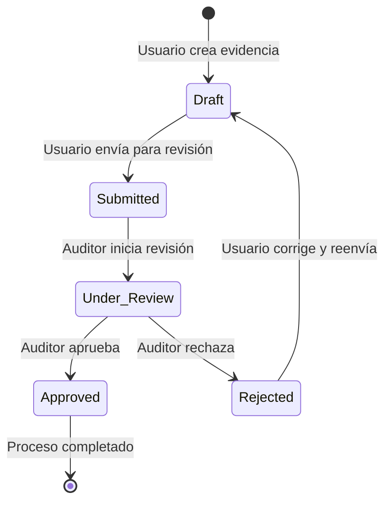

# Especificación de Casos de Uso - Frontend AgroExtensión Digital

## 1. Introducción

### 1.1 Propósito
Este documento especifica los casos de uso del directorio `frontend` del proyecto AgroExtensión Digital, una plataforma multi-tenant de extensión agrícola con arquitectura de microservicios.

### 1.2 Alcance
El frontend es una aplicación Next.js 15 que proporciona interfaces de usuario para tres tipos de usuarios principales: administradores del sistema, auditores de certificación y usuarios de negocio.

### 1.3 Estado Actual del Sistema
- **Framework**: Next.js 15 + TypeScript
- **Autenticación**: Firebase Auth con custom claims multi-tenant
- **Base de Datos**: Google Firestore con diseño multi-tenant
- **Estilos**: Tailwind CSS
- **Gestión de Rutas**: Protecciones basadas en constantes `USER_TYPES` y `UserTypeId`
- **Desarrollo**: `pnpm dev` en directorio `frontend`

### 1.4 Modelo de Datos Crítico
El `data_model` define colecciones Firestore esenciales:
- `user_types`: Tipos de usuario (document_id = id = name)
- `users`: Perfiles de usuario con asociaciones de negocio
- `businesses`: Entidades tenant del sistema
- `auditor_profiles`: Perfiles específicos de auditores

## 2. Actores del Sistema

| Actor | Descripción | Tipo de Usuario |
|-------|-------------|-----------------|
| **Administrador del Sistema** | Gestiona configuración global, tipos de usuario y negocios | `admin` |
| **Auditor de Certificación** | Revisa y aprueba evidencias de certificación | `auditor` |
| **Usuario de Negocio** | Sube evidencias y gestiona documentación de certificación | `business_user` |

## 3. Casos de Uso

### UC-001: Autenticación y Gestión de Sesión Multi-tenant

**Actor Principal**: Todos los usuarios del sistema
**Stakeholders**: Administrador del Sistema, Auditor, Usuario de Negocio
**Precondiciones**: 
- Usuario tiene cuenta válida en Firebase Auth
- Firestore contiene datos de usuario y asociaciones de negocio

**Garantías de Éxito**: 
- Usuario autenticado con sesión activa
- Contexto de negocio establecido correctamente
- Claims personalizados cargados

**Escenario Principal de Éxito**:
1. Usuario navega a la aplicación
2. Sistema redirige a página de login de Firebase
3. Usuario ingresa credenciales válidas
4. Firebase Auth valida credenciales y genera token
5. Sistema lee custom claims del token
6. Sistema carga perfil de usuario desde colección `users`
7. Si usuario tiene múltiples negocios asociados, sistema muestra selector
8. Usuario selecciona negocio (tenant) activo
9. Sistema establece contexto de sesión con `uid`, `userType`, `businessId`
10. Sistema redirige a dashboard apropiado según `userType`

**Extensiones**:
- 4a. Credenciales inválidas: mostrar error y permitir reintento
- 6a. Perfil de usuario no encontrado: crear perfil básico o mostrar error
- 8a. Usuario con un solo negocio: saltar selector y usar negocio por defecto

**Requisitos Especiales**:
- Tiempo de respuesta < 3 segundos para autenticación
- Tokens deben renovarse automáticamente
- Mantener consistencia entre custom claims y datos Firestore

---

### UC-002: Control de Acceso a Rutas Protegidas

**Actor Principal**: Todos los usuarios autenticados
**Stakeholders**: Administrador del Sistema
**Precondiciones**: 
- Usuario autenticado con sesión válida
- Ruta tiene configuración de `requiredUserTypes`

**Garantías de Éxito**: 
- Acceso concedido solo a usuarios autorizados
- Redirección apropiada para usuarios no autorizados

**Escenario Principal de Éxito**:
1. Usuario navega a ruta protegida
2. Middleware/ProtectedRoute verifica estado de autenticación
3. Sistema valida `userType` del usuario contra `requiredUserTypes` de la ruta
4. Si usuario autorizado, sistema permite acceso a la ruta
5. Sistema renderiza componente apropiado

**Extensiones**:
- 2a. Usuario no autenticado: redirigir a página de login
- 3a. Usuario sin permisos: mostrar página 403 o redirigir a dashboard
- 3b. Desincronización de tipos: ejecutar verificación con `verify_basic_types_sync.py`

**Requisitos Especiales**:
- Validación tanto client-side como server-side
- Logs de intentos de acceso no autorizado

---

### UC-003: Gestión de Evidencias por Usuario de Negocio

**Actor Principal**: Usuario de Negocio
**Stakeholders**: Auditor de Certificación
**Precondiciones**: 
- Usuario autenticado como `business_user`
- Contexto de negocio establecido

**Garantías de Éxito**: 
- Evidencia guardada en Firestore con metadatos correctos
- Archivos almacenados en Firebase Storage (si aplica)
- Notificación enviada a sistema de auditoría

**Escenario Principal de Éxito**:
1. Usuario navega a sección de evidencias
2. Sistema muestra formulario de carga de evidencia
3. Usuario completa metadatos requeridos (tipo, descripción, fecha)
4. Usuario selecciona archivos para subir
5. Sistema valida formato y tamaño de archivos
6. Sistema sube archivos a Firebase Storage
7. Sistema crea documento en colección de evidencias con estado 'draft'
8. Usuario revisa información y confirma envío
9. Sistema actualiza estado a 'submitted'
10. Sistema notifica a agentes/microservicios para procesamiento

**Extensiones**:
- 4a. Archivos muy grandes: mostrar progreso de subida y permitir cancelación
- 5a. Formato inválido: mostrar error y formatos aceptados
- 6a. Error de red: permitir reintento o guardar como borrador
- 9a. Error de validación: mostrar errores específicos y permitir corrección

**Requisitos Especiales**:
- Soporte para archivos hasta 50MB
- Progreso visual durante subida
- Autoguardado de borradores cada 30 segundos

---

### UC-004: Revisión y Auditoría de Evidencias

**Actor Principal**: Auditor de Certificación
**Stakeholders**: Usuario de Negocio, Administrador del Sistema
**Precondiciones**: 
- Usuario autenticado como `auditor`
- Evidencias en estado 'submitted' disponibles

**Garantías de Éxito**: 
- Decisión de auditoría registrada en sistema
- Usuario de negocio notificado del resultado
- Historial de auditoría mantenido

**Escenario Principal de Éxito**:
1. Auditor navega a panel de evidencias pendientes
2. Sistema muestra lista filtrable de evidencias por negocio
3. Auditor selecciona evidencia para revisar
4. Sistema muestra detalles completos y archivos adjuntos
5. Auditor descarga y revisa archivos
6. Auditor registra observaciones y comentarios
7. Auditor toma decisión (aprobar/rechazar)
8. Sistema actualiza estado de evidencia
9. Sistema registra entrada en historial de auditoría
10. Sistema notifica resultado a usuario de negocio

**Extensiones**:
- 3a. Evidencia ya revisada: mostrar historial y permitir re-auditoría
- 7a. Información insuficiente: marcar como 'pending_info' y solicitar aclaraciones
- 8a. Error al actualizar: reintentar y notificar error si persiste

**Requisitos Especiales**:
- Viewer integrado para tipos de archivo comunes
- Historial completo de todas las acciones de auditoría
- Notificaciones en tiempo real

---

### UC-005: Administración de Sistema Multi-tenant

**Actor Principal**: Administrador del Sistema
**Stakeholders**: Todos los usuarios
**Precondiciones**: 
- Usuario autenticado como `admin`
- Acceso a herramientas de administración

**Garantías de Éxito**: 
- Cambios de configuración aplicados correctamente
- Consistencia mantenida entre frontend y backend
- Logs de auditoría generados

**Escenario Principal de Éxito**:
1. Administrador navega a panel de administración
2. Sistema muestra dashboard con métricas y herramientas
3. Administrador selecciona gestión de tipos de usuario
4. Sistema muestra tipos actuales con estado de sincronización
5. Administrador crea/modifica tipos de usuario
6. Sistema valida que `document_id = id = name`
7. Sistema actualiza colección `user_types` en Firestore
8. Sistema ejecuta verificación de sincronización
9. Sistema muestra confirmación y estado actualizado

**Extensiones**:
- 6a. Validación falla: mostrar errores específicos y prevenir guardado
- 8a. Desincronización detectada: mostrar herramientas de re-sincronización
- 8b. Error crítico: rollback cambios y notificar administrador

**Requisitos Especiales**:
- Herramientas de verificación integradas (`verify_basic_types_sync.py`)
- Respaldo automático antes de cambios críticos
- Logs detallados de todas las operaciones administrativas

---

### UC-006: Alternancia de Contexto de Negocio

**Actor Principal**: Usuario con múltiples negocios asociados
**Stakeholders**: Administrador del Sistema
**Precondiciones**: 
- Usuario autenticado con acceso a múltiples negocios
- Datos de asociaciones válidas en Firestore

**Garantías de Éxito**: 
- Contexto de negocio cambiado sin perder sesión
- Todas las operaciones subsecuentes usan nuevo contexto
- Estado de UI actualizado apropiadamente

**Escenario Principal de Éxito**:
1. Usuario hace clic en selector de negocio en header
2. Sistema muestra lista de negocios disponibles
3. Usuario selecciona nuevo negocio
4. Sistema valida permisos del usuario para el negocio seleccionado
5. Sistema actualiza contexto local (`businessId`)
6. Sistema refresca datos específicos del negocio
7. Sistema actualiza URL si es necesario
8. Sistema muestra confirmación visual del cambio

**Extensiones**:
- 4a. Permisos insuficientes: mostrar error y mantener contexto actual
- 6a. Error al cargar datos: mostrar indicador de carga y reintentar
- 7a. Ruta no válida para nuevo contexto: redirigir a dashboard

**Requisitos Especiales**:
- Transición fluida sin pérdida de estado de formularios
- Validación de permisos server-side
- Persistencia de selección entre sesiones

---

### UC-007: Integración con Microservicios Backend

**Actor Principal**: Sistema Frontend
**Stakeholders**: Agentes de procesamiento, Webhooks
**Precondiciones**: 
- Microservicios backend operativos
- Configuración de eventos Firestore activa

**Garantías de Éxito**: 
- Eventos disparados correctamente a backend
- Respuestas procesadas y mostradas en UI
- Estados sincronizados entre frontend y backend

**Escenario Principal de Éxito**:
1. Usuario ejecuta acción que requiere procesamiento backend
2. Frontend crea/actualiza documento en Firestore
3. Backend/agentes detectan cambio via listeners
4. Agentes procesan solicitud asincrónicamente
5. Agentes actualizan documento con resultado
6. Frontend detecta cambio via listeners en tiempo real
7. Frontend actualiza UI con nuevo estado/resultado

**Extensiones**:
- 3a. Backend no disponible: mostrar indicador de procesamiento pendiente
- 4a. Error en procesamiento: actualizar documento con error y mostrar mensaje
- 6a. Pérdida de conexión: reestablecer listeners y sincronizar estado

**Requisitos Especiales**:
- Timeouts apropiados para operaciones asincrónicas
- Indicadores visuales de estado de procesamiento
- Manejo robusto de reconexiones

## 4. Contratos de Datos
### 4.1 Interfaces de Datos Principales

```typescript
// Usuario del sistema
interface User {
  uid: string;
  name: string;
  email: string;
  userType: UserTypeId;
  businesses: string[];
  createdAt: Timestamp;
  lastLogin: Timestamp;
}

// Entidad de negocio (tenant)
interface Business {
  id: string;
  name: string;
  description: string;
  ownerId: string;
  members: string[];
  metadata: Record<string, any>;
  status: 'active' | 'suspended' | 'inactive';
  createdAt: Timestamp;
}

// Evidencia de certificación
interface Evidence {
  id: string;
  businessId: string;
  uploadedBy: string;
  title: string;
  description: string;
  type: 'document' | 'image' | 'video' | 'other';
  files: FileMetadata[];
  status: 'draft' | 'submitted' | 'under_review' | 'approved' | 'rejected';
  auditTrail: AuditEntry[];
  metadata: Record<string, any>;
  createdAt: Timestamp;
  updatedAt: Timestamp;
}

// Perfil de auditor
interface AuditorProfile {
  userId: string;
  certifications: string[];
  specializations: string[];
  assignedBusinesses: string[];
  status: 'active' | 'inactive';
}

// Tipos de usuario (Firestore)
interface UserType {
  id: string; // debe coincidir con document_id y name
  name: string;
  description: string;
  permissions: string[];
  routes: string[];
}
```

### 4.2 Estados y Transiciones



## 5. Requisitos No Funcionales

### 5.1 Rendimiento
- Tiempo de carga inicial < 3 segundos
- Tiempo de respuesta para operaciones CRUD < 1 segundo
- Soporte para subida de archivos hasta 50MB con progreso visual

### 5.2 Seguridad
- Autenticación mediante Firebase Auth
- Validación de permisos tanto client-side como server-side
- Tokens JWT con renovación automática
- Logs de auditoría para operaciones sensibles

### 5.3 Usabilidad
- Interfaz responsive compatible con dispositivos móviles
- Indicadores visuales de estado de carga
- Mensajes de error claros y accionables
- Navegación intuitiva entre contextos de negocio

### 5.4 Confiabilidad
- Autoguardado de formularios cada 30 segundos
- Reconexión automática en caso de pérdida de conectividad
- Validación de sincronización entre frontend y backend

## 6. Casos de Prueba

### 6.1 Pruebas de Humo
```bash
# Configuración inicial
cd frontend
pnpm install
pnpm dev

# Verificación básica
# 1. Cargar aplicación en http://localhost:3000
# 2. Verificar redirect a login
# 3. Completar flujo de autenticación
# 4. Verificar acceso a dashboard según tipo de usuario
```

### 6.2 Pruebas de Integración
- Sincronización de tipos de usuario: `cd data_model && uv run verify_basic_types_sync.py`
- Validación de permisos por tipo de usuario
- Prueba de alternancia de contexto de negocio
- Verificación de subida y procesamiento de evidencias

### 6.3 Pruebas de Borde
- Manejo de tokens expirados
- Comportamiento con conexión intermitente
- Validación con archivos de gran tamaño
- Pruebas de concurrencia en modificación de evidencias

## 7. Consideraciones de Arquitectura

### 7.1 Patrones de Diseño Implementados
- **Multi-tenant Architecture**: Separación por `businessId`
- **Protected Routes**: Middleware de autorización
- **Context Pattern**: Gestión de estado de autenticación
- **Observer Pattern**: Listeners de Firestore en tiempo real

### 7.2 Integraciones Críticas
- **Firebase Auth**: Gestión de identidad y custom claims
- **Firestore**: Persistencia de datos con listeners en tiempo real
- **Firebase Storage**: Almacenamiento de archivos de evidencia
- **Microservicios Backend**: Procesamiento asincrónico via eventos

### 7.3 Puntos de Extensibilidad
- Sistema de plugins para nuevos tipos de evidencia
- Configuración dinámica de flujos de auditoría
- Integración con sistemas externos de certificación
- API para herramientas de terceros

## 8. Mantenimiento y Monitoreo

### 8.1 Scripts de Verificación
```bash
# Verificación de sincronización de tipos de usuario
cd data_model && uv run verify_basic_types_sync.py

# Normalización de formato de IDs
cd data_model && uv run normalize_user_types_format.py

# Listado de colecciones Firestore
cd data_model && uv run list_collections.py
```

### 8.2 Métricas Recomendadas
- Tiempo de respuesta por caso de uso
- Tasa de éxito de subidas de archivos
- Errores de autenticación y autorización
- Uso de recursos por tenant

### 8.3 Logs de Auditoría
- Acciones administrativas en tipos de usuario
- Cambios de estado en evidencias
- Intentos de acceso no autorizado
- Operaciones de alternancia de contexto

## 9. Roadmap y Mejoras Futuras

### 9.1 Corto Plazo (Sprint actual)
- [ ] Implementar script de verificación en CI/CD
- [ ] Añadir botones de re-sincronización en panel admin
- [ ] Documentar endpoints backend utilizados por frontend

### 9.2 Mediano Plazo
- [ ] Migración a offline-first con Progressive Web App
- [ ] Implementación de notificaciones push
- [ ] Dashboard analítico para administradores

### 9.3 Largo Plazo
- [ ] Integración con blockchain para certificaciones inmutables
- [ ] IA para pre-validación automática de evidencias
- [ ] API pública para integraciones de terceros

---

**Documento generado**: `docs/frontend/USE_CASES.md`  
**Formato aplicado**: IEEE/UML estándar para especificación de casos de uso  
**Última actualización**: Septiembre 2025
